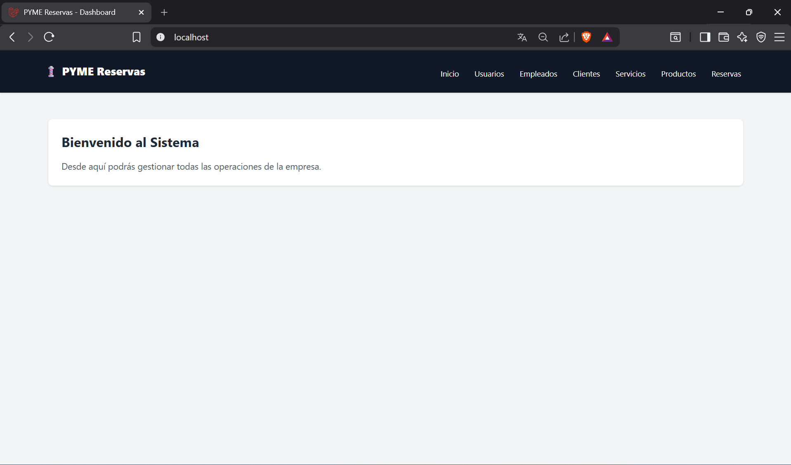

# sistema Web de Gestión de Servicios y Reservas (PYME)

Este repositorio contiene el código fuente del proyecto de grado para optar al título de Tecnólogo en Gestión de Sistemas de Información (COTECNOVA).

**Caso de Estudio:** Barbería.
**Enfoque:** Adaptable a Pequeñas y Medianas Empresas (PYMES) del sector servicios.

## estado actual del proyecto
**Fase 1 Completada:** 
- Configuración de entorno con Docker (Laravel Sail) y WSL2.
- Diseño de Arquitectura MVC (Esqueleto inicial).
- Implementación de Layout principal (Plantilla Maestra con Tailwind CSS vía CDN).
- Configuración de Rutas y Controladores para módulos principales (sin conexión a Base de Datos).

## stack  base
- **Framework:** Laravel (PHP)
- **Base de Datos:** MySQL
- **Entorno de Desarrollo:** Docker Compose (Laravel Sail)
- **Frontend (UI):** Blade Templates + Tailwind CSS (CDN)
- **Control de Versiones:** Git / GitHub

## modulos del Sistema (Arquitectura de Navegación)
El sistema cuenta actualmente con la estructura de vistas y controladores para:
1. Dashboard (Inicio)
2. Gestión de Usuarios
3. Gestión de Empleados
4. Gestión de Clientes
5. Catálogo de Servicios
6. Catálogo de Productos
7. Gestión de Reservas

## instrucciones para levantar el entorno local
Al estar basado en Laravel Sail, no es necesario tener PHP o MySQL instalados en la máquina local.

1. Clonar el repositorio.
2. Copiar el archivo de entorno: `cp .env.example .env` (Asegurar que `SESSION_DRIVER=file` por ahora).
3. Levantar los contenedores de Docker:
   ```bash
   ./vendor/bin/sail up -d
## Captura prueba del avance 1

